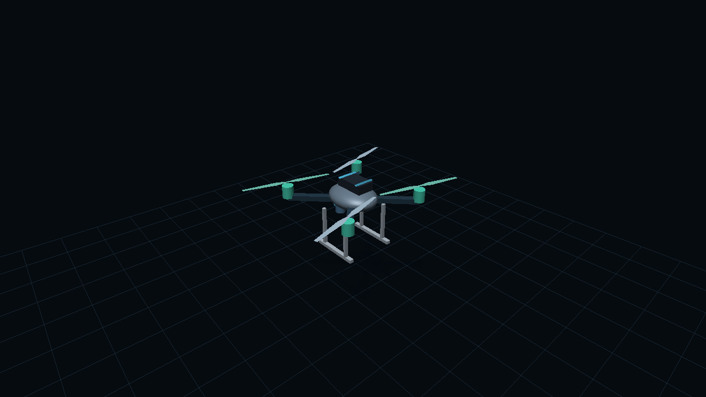

# Drone Weather Lab 0.8

[Русская документация](README.md)

Explore how wind, weather and design choices affect a multirotor drone. Change the mass, propellers or motors, watch the position hold response, inspect the computed airflow, and compare two configurations under the same weather.

## Quick start

If you have a published simulator link, open it directly. No installation is needed to use a hosted copy.

To run the downloaded project:

1. Extract the ZIP. Open the folder containing `README.md`, `Start.cmd` and `dist`.
2. On Windows, double click `Start.cmd`. Python 3 must be installed. The simulator opens automatically; keep the console window open.
3. Alternatively, open a terminal in that folder and run:

```sh
python scripts/start.py
```

On Windows, `py scripts/start.py` also works. The address is `http://127.0.0.1:8000/`. If the port is busy, use `python scripts/start.py --port 8001`. Press Ctrl+C to stop.

Opening `dist/index.html` by double clicking is not the supported launch method. JavaScript modules and calculation workers need an HTTP server. The simulator uses HTML, CSS and JavaScript. Python only serves the files locally; it does not perform the drone calculations. No npm installation or external rendering library is required.

## Try a first experiment

Select English in the language menu and Metric in the units menu. These choices are independent and saved on your device.

1. Keep the camera quadcopter preset. In Flight, increase mean wind from 6 to 12 m/s. Watch displacement, tilt and thrust reserve. Change the wind direction and see how the force arrows respond.
2. Open Charts. Vary wind speed and plot tilt or thrust reserve. Other parameters remain fixed during the sweep.
3. Open Airflow. Start with the Fast grid. Wait for the calculation, rotate the scene, and switch between speed, pressure and vorticity. Open convergence diagnostics to inspect the residual and the cell size.
4. Enable CFD geometry to see the solid cell centres used by the solver. Thin arms or landing gear may not survive on a coarse grid even when they are visible in the rendered model.
5. Open Compare and capture A. Increase payload or change the drone, then capture B. Both calculations use A's weather and healthy motors. Imported CAD and individual motor RPM are not included in this comparison.



The image is an offscreen render of the actual model and project shaders, not a screenshot of the complete interface.

## What changed in 0.8

The interface, help, warnings and chart labels are available in Russian and English. The 3D model uses WebGL with depth testing, lit materials, solid blades and cached geometry. Canvas remains a fallback if WebGL is unavailable. Mean-flow streamlines and their moving particles use the GPU too. The initial line count is now 360 and can be increased to 600.

The built-in drones have body, arms, motors, battery, camera and landing gear where appropriate. Physical parts use the same geometry for rendering and the CFD solid mask. Animated blades represent a rotor disk in CFD; small visual details such as battery straps are decorative. Imported meshes retain the full geometry in WebGL and use a simplified preview in Canvas.

Velocity inlet and reference-density outlet boundaries now retain the neighbouring non-equilibrium distribution. The solver also reports force on all solid objects through momentum exchange and mean density deviation. This force is a diagnostic and does not replace the flight model's drag equation.

A/B comparison evaluates seven metrics with identical weather. Force arrows show weight, actual controller thrust and estimated wind force in Flight. Their lengths use a common visual scale relative to weight.

## Settings and results

| Control or result | Meaning |
| --- | --- |
| Body mass and payload | Combined mass determines weight and required thrust |
| Frame span | Distance between opposite motor centres |
| Propeller diameter | Disk size, affecting thrust, power and induced velocity |
| Pitch | Theoretical advance per revolution; used to estimate coefficients |
| RPM | Revolutions per minute, converted to revolutions per second in equations |
| Motor power | Electrical limit per motor and ESC; shaft power is lower |
| Thrust reserve | Available thrust above the required amount; negative means a shortfall |
| Tilt | Estimated angle needed to oppose horizontal wind |
| Flight time | Energy divided by estimated electrical power, when position hold is feasible |
| Downwash | Ideal induced downward speed at the disks; different from a sampled CFD velocity |
| CFD pressure | Pressure relative to the reference density, not atmospheric pressure |
| Vorticity | Local rotation of the velocity field, in s⁻¹ |
| Residual | Relative velocity change over 20 iterations |
| Solid force | Instantaneous X, Y, Z force on all solids, including added objects |

Metric and imperial units change how values are displayed. Internal parameters retain their original units. Enter precise values next to sliders; both comma and point are accepted. Invalid values leave the last valid setting in place. Line count must be an integer.

Weather includes mean wind, direction, gust amplitude and frequency, irregular gust intensity, vertical wind, rain, temperature, humidity, altitude, pressure and icing. Flight uses a smooth wind vector. The CFD calculation uses mean wind and stationary geometry; it is not restarted for every gust. Changing the mean conditions or geometry queues a new solve. Controls remain available during calculation.

## Build or import a drone

Choose Custom drone to adjust body length, width, height, shape, arm length, arm thickness, stretch, rotor layout and motor dimensions. The builder reports body volume and propeller clearance. Overlapping propellers produce a warning. Geometry does not automatically determine mass or frontal area, which must be entered separately.

Save settings exports JSON. Load settings restores a saved configuration after validating all parameters. It does not include imported CAD, motor damage or separate motor RPM. Export STL produces a concept model in millimetres with Y up. Parts overlap; union and inspect them in CAD before manufacturing.

For a CAD model, export STL or OBJ from Fusion, SolidWorks, FreeCAD or Blender. STEP and IGES need conversion first. The limit is 16 MB and 40,000 triangles. Set the real maximum dimension and up axis. Files are processed locally and are not uploaded.

Enable Use imported body mesh in CFD only after checking its closure, scale and rotor alignment. An open mesh can be displayed but is not accepted as a solid CFD body. Rotor centres follow the selected frame and are not detected automatically from CAD. Thin features may disappear after voxelisation. Use the CFD geometry overlay to inspect the mask.

## Motors and shortcuts

Heat builds up and dissipates gradually. Thermal derating starts above 95 °C and can recover after cooling. Sustained high temperature and overload cause permanent wear. Severe accumulated overheating can trigger illustrative smoke and fire. This model has no measured thermal data for your motor and does not predict a real fire. Commanded RPM also acts as a separate stress scenario; do not read it as measured winding current during hover.

| Key | Action |
| --- | --- |
| Space | Pause or resume Flight and particle playback |
| F | Restore motor temperature, health and fire state |
| R | Restart Flight while keeping parameters and motor condition |
| G | Charts |
| C | Airflow |
| 1 | Flight |
| ? | Show shortcuts |

Shortcuts do not fire while typing in controls. Reset all restores the initial configuration.

## How the calculations work

Air density uses temperature, pressure and humidity. Automatic pressure follows a standard barometric atmosphere. The principal propeller relations are:

$$T = C_T\rho n^2D^4, \qquad P_{shaft} = C_P\rho n^3D^5$$

Here T is thrust in N, P is shaft power in W, ρ is density in kg/m³, n is revolutions per second, and D is diameter in metres. Cₜ and Cₚ are dimensionless. The estimated coefficients can be replaced with measured propeller data. Electrical power includes efficiency losses and auxiliary loads.

Wind force uses:

$$F = \frac{1}{2}\rho C_D A V^2$$

C𝒹 is the drag coefficient, A is projected area in m², and V is speed in m/s. The flight model uses an illustrative position controller, motor limits and battery voltage sag. It is separate from the CFD surface force.

The CFD solver uses D3Q19 lattice Boltzmann distributions, TRT or BGK collision, Guo body forcing, stationary bounce-back solids and actuator disk momentum sources. Streamlines are integrated through the computed field with RK4. Moving particles advance by local travel time. Playback speed changes animation only. More lines improve visibility; they do not refine the numerical grid.

## Accuracy and checks

The included `verification-v08.json` records a sphere case at 3 m/s, diameter 0.36 m and kinematic viscosity 0.035 m²/s. Both grids use the same viscosity. Their drag estimates were 1.313 N and 1.263 N, a relative difference of about 3.94%. Both reached the residual stopping criterion. This is a limited grid sensitivity check, not proof of grid independence or validation against a real drone.

Regression checks cover collision mass and momentum conservation, uniform flows in different directions, hover symmetry, continued solves, worker cancellation, CAD topology, unit conversion, decimal controls, motor degradation, translation coverage, equal-weather comparison and GPU buffer reuse. The GLSL shaders were compiled and linked using Mesa GLES. Integration tests use a simulated DOM and Canvas; a complete visual inspection in a browser was not available for this release.

For the default drone calculations, numerical viscosity is raised for stability. The physical and solver Reynolds numbers differ. The grids contain approximately 13k, 31k or 61k cells. These grids do not resolve real blade aerodynamics, boundary layers or developed turbulence. Icing and rain use empirical corrections. Safety, acoustic effects, vortex ring state and structural strength are not established by these results.

To run the checks, install Node.js with support for `vm.SourceTextModule`, then run:

```sh
node --experimental-vm-modules scripts/verify.mjs
node --experimental-vm-modules scripts/verify-v06.mjs
node --experimental-vm-modules scripts/verify-v07.mjs
node --experimental-vm-modules scripts/verify-v08.mjs
node --experimental-vm-modules scripts/verify-ui.mjs
```

`verify-v08.mjs` regenerates the numerical report. Timings depend on the machine.

## Publish on GitHub Pages

Upload the project contents at the repository root. Keep `README.md`, `README.en.md`, `dist`, `scripts`, `docs` and `.github`. Do not upload only the ZIP or place everything inside an extra version folder.

The workflow is `.github/workflows/pages.yml`. In repository Settings, open Pages and select GitHub Actions as the source. Push or upload changes to `main`. If needed, open Actions, choose Deploy GitHub Pages and run the workflow. Use the website address shown by the successful deployment as the public demo link. For this repository, the expected address is `https://nalibekov044-spec.github.io/drone-weather-lab/`; its public availability was not verified while preparing this release.

A saved repository and a working public website are separate outcomes. Test the deployed link without signing in before sharing it with a reviewer.

## Troubleshooting

| Problem | What to check |
| --- | --- |
| Blank page after opening an HTML file | Start the local HTTP server instead |
| Start.cmd closes or reports Python missing | Install Python 3, then retry with `py scripts/start.py` |
| Calculation is slow | Start with Fast and Quick; reduce the line count separately |
| WebGL is unavailable | The scene falls back to Canvas; try an updated browser or graphics driver |
| Thrust reserve is negative | Check weight, propeller dimensions, RPM and motor power limits |
| Flight time is unavailable | Position hold is not feasible under the selected assumptions |
| CFD has not converged | Continue calculation and inspect residual, Mach number and density deviation |
| Imported-mesh CFD is disabled | Repair the mesh, correct scale and up axis, and keep it within the domain |

## Source layout

| File | Responsibility |
| --- | --- |
| `dist/index.html`, `styles.css` | Interface and layout |
| `dist/app.js` | Controls, flight integration and reports |
| `dist/physics.js`, `systems.js` | Flight estimates, battery and motor thermals |
| `dist/drone-builder.js` | Shared geometry and STL export |
| `dist/scene3d.js`, `gpu-scene.js` | Camera, scene, WebGL and Canvas fallback |
| `dist/cfd-core.js`, `cfd-worker.js` | Numerical flow solver and background execution |
| `dist/flow-lines.js` | Field sampling and streamline integration |
| `dist/mesh-import.js`, `mesh-worker.js` | CAD mesh processing |
| `dist/i18n.js`, `i18n-extra.js` | Translation and language preference |
| `dist/units.js`, `exact-controls.js` | Units and precise inputs |
| `dist/comparison.js`, `renderers.js` | A/B calculations and charts |

## References

[Guo, Zheng and Shi, non-equilibrium boundary extrapolation](https://cpb.iphy.ac.cn/en/article/doi/10.1088/1009-1963/11/4/310) · [NASA, CFD verification and validation](https://www.grc.nasa.gov/www/wind/valid/tutorial/tutorial.html) · [NASA, drag equation](https://www1.grc.nasa.gov/beginners-guide-to-aeronautics/drag-equation/)
