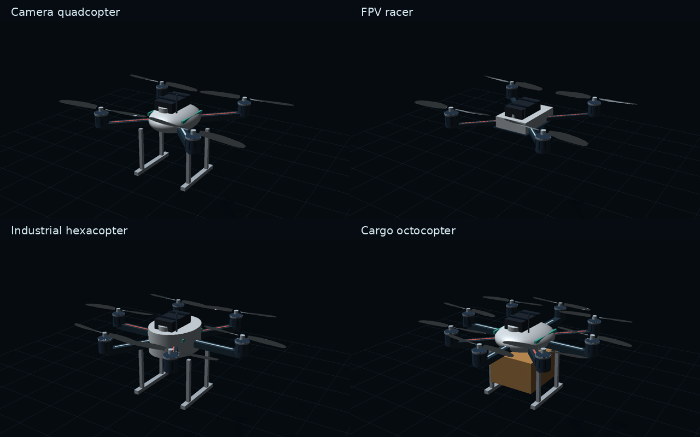

# Drone Weather Lab 0.85 Beta

[Русская документация](README.md)

Explore how wind, weather and design choices affect a multirotor drone. Change the mass, propellers or motors, watch the position hold response, inspect the computed airflow, and compare two configurations under the same weather.

## Open the simulator

**[Online simulator](https://nalibekov044-spec.github.io/drone-weather-lab/)** · **[Release downloads](https://github.com/nalibekov044-spec/drone-weather-lab/releases)**

The online copy opens directly. There is no installation. The links show this version after it has been uploaded to GitHub and Pages has been enabled.

To use a downloaded copy:

1. Download `Drone-Weather-Lab-0.85-Beta.html` from the release. If you download a ZIP, extract it first.
2. Double click the HTML file. If your computer asks which application to use, choose a web browser.
3. The simulator runs without Python, Node.js, a terminal or an internet connection. External documentation links need internet access.

On Windows, `Start.cmd` opens the same file. The `dist` folder is for hosting and development. Use the HTML file at the project root for a normal offline launch.

A Windows build is configured in GitHub Actions. After Build release downloads succeeds, the release receives `Drone-Weather-Lab-0.85-Beta.exe`. It contains the same HTML, extracts it to a local application folder and opens the default browser. It uses .NET Framework 4 and the Windows HTML file association. The executable has not been built or tested on Windows while preparing this archive, and publisher signing is not configured. The HTML download works independently of that build.

## Try a first experiment

Select English in the language menu and Metric in the units menu. These choices are independent and saved on your device.

1. Keep the camera quadcopter preset. In Flight, increase mean wind from 6 to 12 m/s. Watch displacement, tilt and thrust reserve. Change the wind direction and see how the force arrows respond.
2. Open Charts. Vary wind speed and plot tilt or thrust reserve. Other parameters remain fixed during the sweep.
3. Open Airflow. Start with the Fast grid. Wait for the calculation, rotate the scene, and switch between speed, pressure and vorticity. Open convergence diagnostics to inspect the residual and the cell size.
4. Enable CFD geometry to see the solid cell centres used by the solver. Thin arms or landing gear may not survive on a coarse grid even when they are visible in the rendered model.
5. Open Compare and capture A. Increase payload or change the drone, then capture B. Both calculations use A's weather and healthy motors. Imported CAD and individual motor RPM are not included in this comparison.

## Changes in 0.85 Beta

The offline simulator is a single HTML file containing the interface, translations, 3D scene and both background workers. GitHub Pages also serves this file as a download. A separate Actions job builds the Windows launcher and checks that its embedded HTML extracts unchanged.

Motors now have rings, vents and hubs. The models include camera mounts, battery straps, a navigation module and arm lights. Propellers have thickness and a twisted profile. Their geometry is uploaded once when the propeller settings change; animation uses cached geometry and retains the blade angle when a motor stops. Smooth normals now follow the actual part, including rotated ellipsoids and cylinders.

Smagorinsky LES adds local eddy viscosity from the non-equilibrium stress tensor. Rotor disks receive an estimated torque Q = P / ω. Force and torque are normalised over the source cells, and neighbouring disks turn in opposite directions. LES and swirl can be switched off separately.

CFD stopping checks velocity and force changes. Diagnostics show both residuals, boundary mass flow balance, mean force over the last ten samples and peak added viscosity. CFD thrust now includes thermal motor derating, rounded to 10% to avoid restarting the solve every frame.



This is an offscreen render of the project geometry and shaders, not a screenshot of the complete interface.

## Settings and results

| Control or result | Meaning |
| --- | --- |
| Body mass and payload | Combined mass determines weight and required thrust |
| Frame span | Distance between opposite motor centres |
| Propeller diameter | Disk size, affecting thrust, power and induced velocity |
| Pitch | Theoretical advance per revolution; used to estimate coefficients |
| RPM | Revolutions per minute, converted to revolutions per second in equations |
| Motor power | Electrical limit per motor and ESC; shaft power is lower |
| Thrust reserve | Available thrust above the required amount; negative means a shortfall |
| Tilt | Estimated angle needed to oppose horizontal wind |
| Flight time | Energy divided by estimated electrical power, when position hold is feasible |
| Downwash | Ideal induced downward speed at the disks; different from a sampled CFD velocity |
| CFD pressure | Pressure relative to the reference density, not atmospheric pressure |
| Vorticity | Local rotation of the velocity field, in s⁻¹ |
| Residual | Relative velocity change over 20 iterations |
| Solid force | Instantaneous X, Y, Z force on all solids, including added objects |

Metric and imperial units change how values are displayed. Internal parameters retain their original units. Enter precise values next to sliders; both comma and point are accepted. Invalid values leave the last valid setting in place. Line count must be an integer.

Weather includes mean wind, direction, gust amplitude and frequency, irregular gust intensity, vertical wind, rain, temperature, humidity, altitude, pressure and icing. Flight uses a smooth wind vector. The CFD calculation uses mean wind and stationary geometry; it is not restarted for every gust. Changing the mean conditions or geometry queues a new solve. Controls remain available during calculation.

## Build or import a drone

Choose Custom drone to adjust body length, width, height, shape, arm length, arm thickness, stretch, rotor layout and motor dimensions. The builder reports body volume and propeller clearance. Overlapping propellers produce a warning. Geometry does not automatically determine mass or frontal area, which must be entered separately.

Save settings exports JSON. Load settings restores a saved configuration after validating all parameters. It does not include imported CAD, motor damage or separate motor RPM. Export STL produces a concept model in millimetres with Y up. Parts overlap; union and inspect them in CAD before manufacturing.

For a CAD model, export STL or OBJ from Fusion, SolidWorks, FreeCAD or Blender. STEP and IGES need conversion first. The limit is 16 MB and 40,000 triangles. Set the real maximum dimension and up axis. Files are processed locally and are not uploaded.

Enable Use imported body mesh in CFD only after checking its closure, scale and rotor alignment. An open mesh can be displayed but is not accepted as a solid CFD body. Rotor centres follow the selected frame and are not detected automatically from CAD. Thin features may disappear after voxelisation. Use the CFD geometry overlay to inspect the mask.

## Motors and shortcuts

Heat builds up and dissipates gradually. Thermal derating starts above 95 °C and can recover after cooling. Sustained high temperature and overload cause permanent wear. Severe accumulated overheating can trigger illustrative smoke and fire. This model has no measured thermal data for your motor and does not predict a real fire. Commanded RPM also acts as a separate stress scenario; do not read it as measured winding current during hover.

| Key | Action |
| --- | --- |
| Space | Pause or resume Flight and particle playback |
| F | Restore motor temperature, health and fire state |
| R | Restart Flight while keeping parameters and motor condition |
| G | Charts |
| C | Airflow |
| 1 | Flight |
| ? | Show shortcuts |

Shortcuts do not fire while typing in controls. Reset all restores the initial configuration.

## How the calculations work

Air density uses temperature, pressure and humidity. Automatic pressure follows a standard barometric atmosphere. The principal propeller relations are:

$$T = C_T\rho n^2D^4, \qquad P_{shaft} = C_P\rho n^3D^5$$

Here T is thrust in N, P is shaft power in W, ρ is density in kg/m³, n is revolutions per second, and D is diameter in metres. Cₜ and Cₚ are dimensionless. The estimated coefficients can be replaced with measured propeller data. Electrical power includes efficiency losses and auxiliary loads.

Wind force uses:

$$F = \frac{1}{2}\rho C_D A V^2$$

C𝒹 is the drag coefficient, A is projected area in m², and V is speed in m/s. The flight model uses an illustrative position controller, motor limits and battery voltage sag. It is separate from the CFD surface force.

The CFD solver uses D3Q19 lattice Boltzmann distributions, TRT or BGK collision, Guo body forcing, stationary bounce-back solids and actuator disk momentum sources. Streamlines are integrated through the computed field with RK4. Moving particles advance by local travel time. Playback speed changes animation only. More lines improve visibility; they do not refine the numerical grid.

Rotor torque is estimated as $Q=P_{shaft}/\omega$, where $\omega=2\pi n$. Shaft power and RPM are adjusted to the estimated disk operating point. The tangential source preserves the requested torque around Y without adding a net lateral force.

The LES relation is $\nu_t=(C_s\Delta)^2|S|$, with $C_s=0.12$. Local relaxation time comes from the non-equilibrium stress tensor $\Pi$:

$$\tau_{eff}=\frac{\tau_0+\sqrt{\tau_0^2+18C_s^2\sqrt{2\Pi:\Pi}/\rho}}{2}$$

The tensor and density use lattice units; $\Pi:\Pi$ is the sum of squared tensor components, including symmetric off-diagonal entries. The tensor includes a Guo forcing correction. Added viscosity sits on top of the base numerical viscosity. It does not restore the physical viscosity of air. No separate near-wall damping model is implemented.

Boundary mass flow is integrated as $\sum\rho u_n\Delta A$, using trapezoidal weights at face edges. An imbalance during development can correspond to mass changing inside the domain. It is a diagnostic rather than proof of accuracy.

## Accuracy and checks

Checks for this version are recorded in `verification-v085.json`. A periodic shear wave on 32 cells over 200 steps differs from the analytical amplitude decay by 0.36% for BGK and 0.17% for TRT. The actuator test produces 3.99999996 N for a requested 4 N and 0.0599999999 N·m for a requested 0.06 N·m, with negligible net lateral force.

Checks cover uniform flow with LES, boundary balance, sphere drag direction and symmetry, finite drone fields with rotor torque, mass and momentum conservation, continued worker calculations, translations, precise input and UI integration. Shaders compile on Mesa GLES. Model appearance was inspected in an offscreen GPU render. The complete page has not been run in a normal browser here, and the Windows launcher has not been run on Windows.

The LES sphere case on the Fast grid reaches the velocity and force stopping criteria, with a boundary flow imbalance of about 0.007%. The 200-step drone case has not converged and is labelled accordingly in the report. Its peak lattice Mach number is about 0.24, so compressibility remains a material limitation. `verification-v08.json` retains the previous two-grid check; grid independence is not established for 0.85 Beta.

Numerical viscosity is elevated and physical and solver Reynolds numbers differ. The available grids have about 13k, 31k and 61k cells. LES and rotor torque do not resolve individual blades, boundary layers or real blade-tip vortices. Rain, ice and motor degradation use estimated coefficients. There is no wind-tunnel or real-drone comparison yet.

To run the checks, install Node.js with support for `vm.SourceTextModule`, then run:

```sh
node --experimental-vm-modules scripts/verify.mjs
node --experimental-vm-modules scripts/verify-v06.mjs
node --experimental-vm-modules scripts/verify-v07.mjs
node --experimental-vm-modules scripts/verify-v085.mjs
node --experimental-vm-modules scripts/verify-ui.mjs
node --experimental-vm-modules scripts/verify-ui.mjs --offline
node scripts/verify-standalone.mjs
```

`verify-v085.mjs` regenerates the numerical report. Timings depend on the machine.

## Publish on GitHub

1. Upload the archive contents at the repository root, including `.github`, `desktop`, `docs`, `dist`, `scripts`, both README files and the standalone HTML. Do not add another version folder around them.
2. For the website, open Settings, Pages and select GitHub Actions. Wait for Deploy GitHub Pages to succeed. Copy the address from Settings, Pages and check it without signing in.
3. For downloadable files, open Actions, select Build release downloads and choose Run workflow. A successful run provides the files under Artifacts.
4. To attach builds automatically to a release, create the tag `v0.85.0-beta`. In Releases, choose Draft a new release, create that tag from `main` and select Set as a pre-release. Publishing it runs the build and attaches the HTML, ZIP and Windows executable.

Release text is in `RELEASE.en.md`. The source archive does not contain a compiled executable. A Windows job builds it. If that job fails, its log is available in Actions; the HTML download remains usable independently.

After editing source modules, rebuild the single file with `node scripts/build-standalone.mjs`. This is only for developers. Pages and release jobs rebuild it automatically. Developers working with separate modules can use `python scripts/start.py`; visitors do not need it.

## Troubleshooting

| Problem | What to check |
| --- | --- |
| Blank page after opening HTML | Open the root HTML file in a browser, rather than `dist/index.html` |
| Start.cmd does not open the simulator | Open the HTML file directly in a browser |
| Calculation is slow | Start with Fast and Quick; reduce the line count separately |
| WebGL is unavailable | The scene falls back to Canvas; try an updated browser or graphics driver |
| Thrust reserve is negative | Check weight, propeller dimensions, RPM and motor power limits |
| Flight time is unavailable | Position hold is not feasible under the selected assumptions |
| CFD has not converged | Continue calculation and inspect residual, Mach number and density deviation |
| Imported-mesh CFD is disabled | Repair the mesh, correct scale and up axis, and keep it within the domain |

## Source layout

| File | Responsibility |
| --- | --- |
| `dist/index.html`, `styles.css` | Interface and layout |
| `dist/app.js` | Controls, flight integration and reports |
| `dist/physics.js`, `systems.js` | Flight estimates, battery and motor thermals |
| `dist/drone-builder.js` | Shared geometry and STL export |
| `dist/scene3d.js`, `gpu-scene.js` | Camera, scene, WebGL and Canvas fallback |
| `dist/cfd-core.js`, `cfd-worker.js` | Numerical flow solver and background execution |
| `dist/flow-lines.js` | Field sampling and streamline integration |
| `dist/mesh-import.js`, `mesh-worker.js` | CAD mesh processing |
| `dist/i18n.js`, `i18n-extra.js` | Translation and language preference |
| `dist/units.js`, `exact-controls.js` | Units and precise inputs |
| `dist/comparison.js`, `renderers.js` | A/B calculations and charts |

## References

[OpenLB, Smagorinsky formulation](https://www.openlb.net/DoxyGen/html/d7/dcf/collisionLES_8h_source.html) · [Microsoft, .NET Framework versions](https://learn.microsoft.com/en-us/dotnet/framework/install/versions-and-dependencies) · [Guo, Zheng and Shi, non-equilibrium boundary extrapolation](https://cpb.iphy.ac.cn/en/article/doi/10.1088/1009-1963/11/4/310) · [NASA, CFD verification and validation](https://www.grc.nasa.gov/www/wind/valid/tutorial/tutorial.html) · [NASA, drag equation](https://www1.grc.nasa.gov/beginners-guide-to-aeronautics/drag-equation/)
